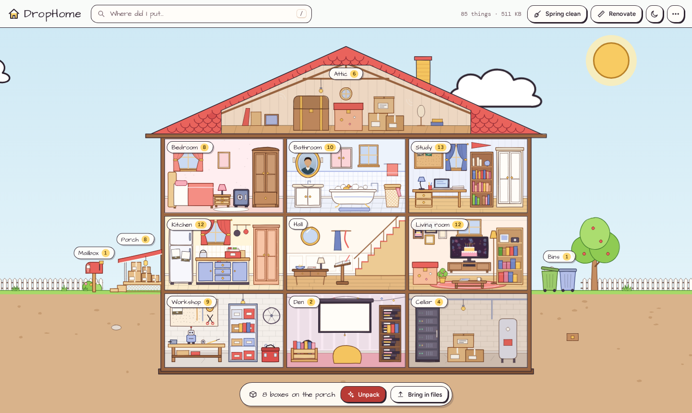
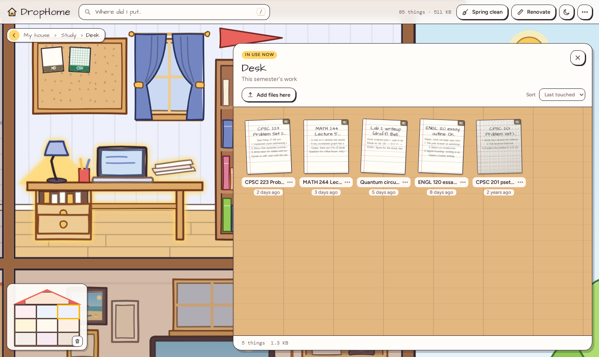
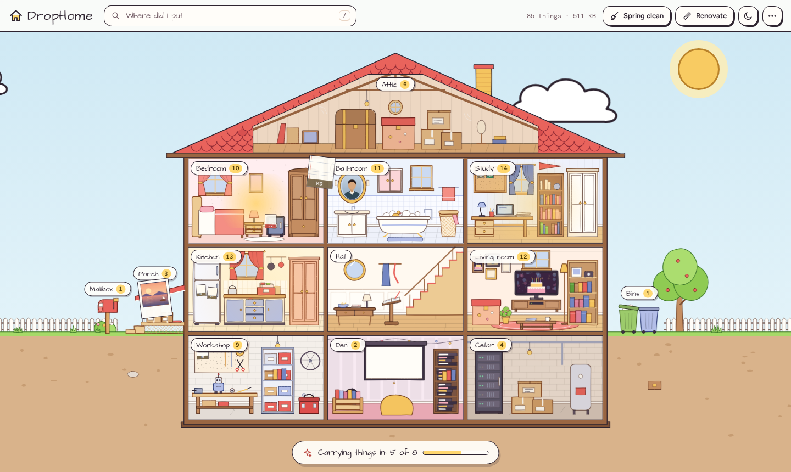
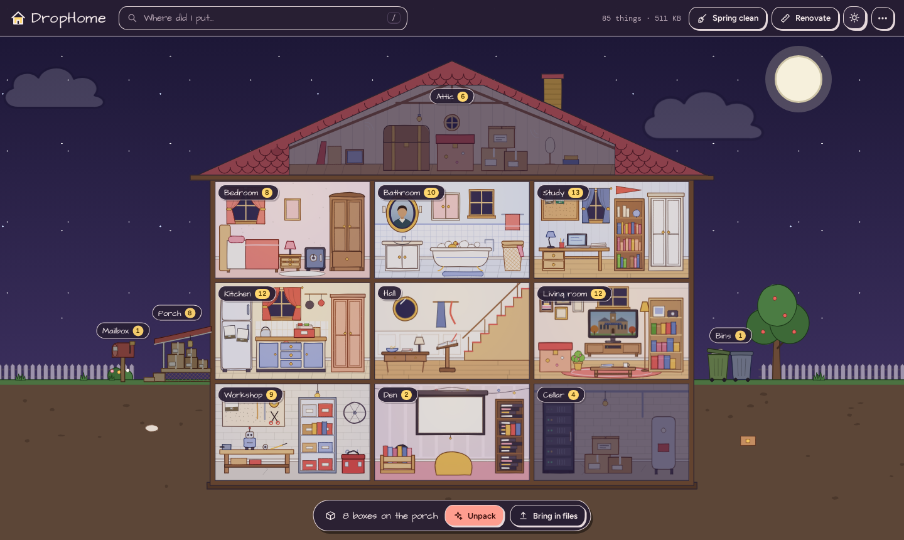
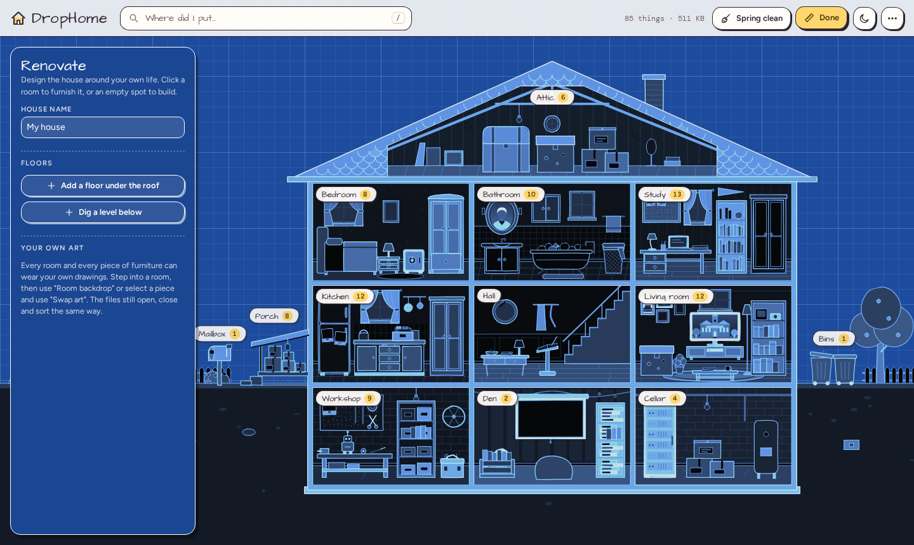

# DropHome
File storage that looks like your room. Keep files in the closet, the dresser, or the desk, and find them the way you find real things!

https://youtube.com/shorts/1WZo-_bdsCs 

**A house for your files.** Built for the Dropbox challenge: *turn digital chaos into something useful* and *reimagine how we organize digital content*.

Folders have been around for decades, and nobody remembers what they put in them. But everybody knows where things go in a house. Recipes live in the kitchen. Schoolwork is on the desk, and last semester's is in the closet. Old stuff ends up in the attic. DropHome uses that instead of a folder tree.



## What it does

| | |
|---|---|
| **Walk in** | Click a room and the camera steps inside. Click a desk, a closet, a fridge, and it opens. Files are physical things: photos are polaroids, notes are lined paper, code is a dark card, zips are taped-up boxes. |
| **One grammar, every room** | Surfaces hold what you are working on now. Closets and shelves hold the past, grouped by year. Walls and screens show what you pinned. Learn it once in the study and you already know the kitchen. |
| **The porch** | Drop files anywhere on the house and they land on the porch as packages. One click and the house unpacks them: Claude reads names, dates and first lines, and carries each file to the right piece of furniture, with a one-line reason. No API key? A built-in rule set does the same job, so the demo never breaks. |
| **Search that walks you there** | Press `/`, type "lease", hit enter. The camera flies to the bedroom, the safe swings open, and the file wiggles. Or ask in plain words: "where is my resume?" |
| **The house notices** | Files gather dust the longer you leave them. A room's lights are on when you used it in the last two weeks. Spring cleaning boxes up anything untouched for a year and carries it to the attic, and bins exact duplicates. |
| **Live walls** | Pin a photo and it shows up in a frame on the living room wall and plays on the TV. Pin a grocery list and it goes on the fridge door. The hall shows what you touched last and everything you have shared. |
| **Renovate** | Flip the house into a blueprint and design your own: add floors, build rooms from templates, drag furniture around, rename anything, change what a piece *means*. The sorter reads your room descriptions, so a custom house sorts correctly. |
| **Drawn, not rendered** | The whole house is drawn in code in one warm, hand-inked style: a wobbly marker line, flat fills, coral and peach and tan wood on near-white walls. Every piece opens on hover. The art sits behind a small manifest, so any room or piece can be swapped for your own drawing (closed and open states, moving layers on their own hinges, or flipbook frames) and nothing else changes. See [docs/ART_GUIDE.md](docs/ART_GUIDE.md). |
| **The Dropbox basics** | Storage on a server, live sync between open windows, share links, a drop link so other people can put files in your mailbox, and bins that keep things for 30 days. |



| Unpacking the porch | Night | Renovate mode |
|---|---|---|
|  |  |  |

## Run it

You need Node 20 or newer.

```bash
npm install        # installs the root, the client and the server
npm run dev        # server on :8787, client on :5173
```

Open <http://localhost:5173>. The first run moves in about 85 sample files so there is something to explore. "Start with an empty house" in the menu (top right) clears them.

For a single process, the way you would deploy it:

```bash
npm run build      # builds client/dist
npm start          # serves the API and the built client on http://localhost:8787
```

### Sorting with Claude (optional)

```bash
cp server/.env.example server/.env
# then put your key in server/.env
ANTHROPIC_API_KEY=sk-ant-...
```

Restart the server. The Unpack button now says "Unpack with Claude". Without a key, everything still works using the built-in rules in `client/src/ai/rules.ts`.

### Front end only

`npm --prefix client run dev` with no server running also works. The client notices there is no API and keeps the whole house in this browser (IndexedDB). That is also how the single-file demo build works:

```bash
npm run build:artifact    # -> artifact/roomy.html, everything inlined
```

## How it is put together

```
client/                     React + Vite + TypeScript
  src/model/                the data model and the standard house
    types.ts                House > Room > Furniture > File, and the 16 furniture roles
    layout.ts               lot geometry, the camera maths
    templates.ts            room templates and the furniture catalog
    seed.ts                 sample files (text, tiny PDFs, WAV tones, SVG photos)
  src/art/                  the house art, drawn in code with rough.js (palette.ts holds the colours)
    furnitureArt.ts         39 pieces, each a list of parts that animate open
    roomArt.ts, lotArt.ts   room backdrops, the house shell and the yard
    customArt.ts            where hand-drawn art plugs in (backdrops, states, moving layers, flipbooks)
  src/ai/                   the sorter: Claude first, rules as the safety net
  src/storage/              server API, IndexedDB, or memory, behind one interface
  src/store/                app state (zustand) and the camera
  src/components/           the stage, rooms, furniture, panels, dialogs
  public/art/               drop your drawings here (see the art guide)
server/                     Express, no database: files on disk + one JSON file
  index.js                  files, share links, mailbox drop link, live sync, reset
  ai.js                     relays sorting prompts to the Anthropic API
docs/
  CONCEPT.md                the pitch and the design thinking
  LAYOUT_FORMAT.md          the house JSON format
  ART_GUIDE.md              the built-in style, and how to swap in your own drawings
  DEMO_SCRIPT.md            a shot list for a two minute demo video
```

### The API

| Method | Path | What it does |
|---|---|---|
| GET | `/api/health` | Is the server up, and can it sort with Claude |
| GET | `/api/state` | The house and every file record |
| PUT | `/api/house` | Save the house layout |
| POST | `/api/files` | Upload one file (`meta` JSON + `file`) |
| PATCH | `/api/files` | Move, rename, pin, bin. `null` clears a field |
| DELETE | `/api/files/:id` | Delete for good |
| GET | `/api/files/:id/content` | The file itself (`?download=1` to save it) |
| POST, DELETE | `/api/files/:id/share` | Create or revoke a share link (`/share/:token`) |
| GET | `/api/drop-link` | A link other people can use to drop files in your mailbox (`/drop/:token`) |
| POST | `/api/art` | Upload custom art for a room or a piece of furniture |
| GET | `/api/events` | Server-sent events, so every open window stays in sync |
| POST | `/api/ai/complete` | Relay a sorting prompt to Claude (501 without a key) |
| POST | `/api/reset` | Wipe everything |

## Honest limits

This is a hackathon build. There are no accounts and no authentication: one server is one person's house, so do not put it on the open internet as is. Files are limited to 250 MB each. Inline previews cover images, text, markdown, code, CSV, audio, video and PDF; everything else downloads.

## Credits

Sketch rendering by [rough.js](https://roughjs.com). Fonts: Architects Daughter, Figtree and DM Mono (SIL Open Font License), self-hosted through Fontsource. Built with Claude.
